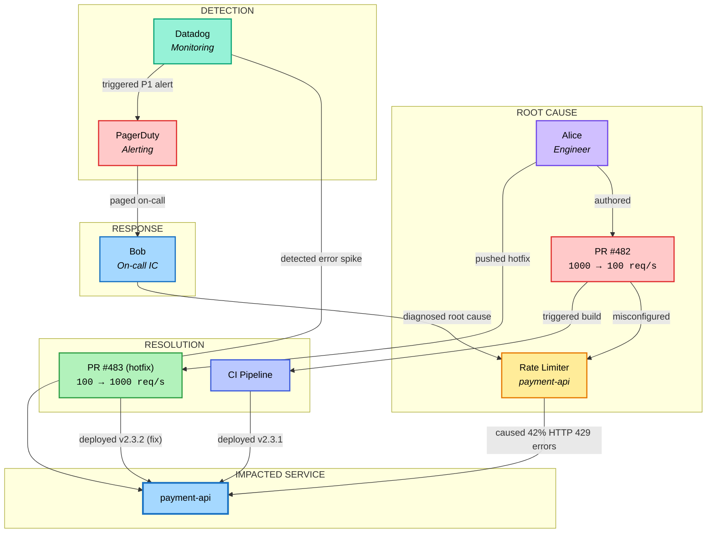

<p align="center">
  
  
  
  
</p>

# Arclight

An incident investigation platform powered by [Graphiti](https://github.com/getzep/graphiti)'s temporal knowledge graph. Ingests timestamped incident events into Neo4j and provides a Streamlit dashboard for interactive investigation using natural language queries.

## Incident Knowledge Graph



> A rate-limiter misconfiguration (PR #482) drops the threshold from 1000 to 100 req/s on `payment-api`, causing a P1 outage with **42% error rate** and **$2,340/min** revenue impact. Detected via Datadog, diagnosed by on-call (Bob), and resolved with hotfix PR #483 within 20 minutes.

## Quick Start

```bash
# 1. Start Neo4j
docker compose up -d

# 2. Create a virtual environment & install dependencies
python -m venv .venv
source .venv/bin/activate
pip install -r requirements.txt

# 3. Configure environment
cp .env.example .env
# Edit .env and add your ANTHROPIC_API_KEY

# 4. Ingest incident data into the knowledge graph
python ingest.py

# 5. Launch the dashboard
streamlit run app.py
```

The dashboard opens at **http://localhost:8501**.

## Architecture

<a href="https://excalidraw.com/#json=">
  <picture>
    <source media="(prefers-color-scheme: dark)" srcset="https://img.shields.io/badge/Open%20in-Excalidraw-6965db?style=for-the-badge&logo=data:image/svg+xml;base64,PHN2ZyB4bWxucz0iaHR0cDovL3d3dy53My5vcmcvMjAwMC9zdmciIHZpZXdCb3g9IjAgMCAyNCAyNCIgZmlsbD0id2hpdGUiPjxwYXRoIGQ9Ik0yMS4yNyA1LjA0bC0yLjMxLTIuMzFhMS41IDEuNSAwIDAwLTIuMTIgMEwzIDE2LjU2VjIxaDQuNDRMMjEuMjcgNy4xNmExLjUgMS41IDAgMDAwLTIuMTJ6TTcuMDEgMTkuMDFIMHYtNy4wMUwxMy41OSA1LjQxbDcgN0w3LjAxIDE5LjAxeiIvPjwvc3ZnPg==&logoColor=white">
    
  </picture>
</a>

> Open [`architecture.excalidraw`](./architecture.excalidraw) in [excalidraw.com](https://excalidraw.com) to view and edit the diagram interactively.

```
┌──────────────────────────────────┐    ┌───────────────────┐
│      Streamlit Dashboard         │    │   Incident Data   │
│           (app.py)               │    │(incident_data.py) │
│ ┌────────┐┌─────────────┐       │    └─────────┬─────────┘
│ │Timeline││Investigation│       │              │
│ └────────┘└─────────────┘       │              ▼
│ ┌────────┐┌──────┐              │    ┌─────────────────────┐
│ │Entities││Report│              │    │  Ingest Pipeline    │
│ └────────┘└──────┘              │    │    (ingest.py)      │
└────────────────┬─────────────────┘    └──────────┬──────────┘
                 │                                 │
                 └────────────┬────────────────────┘
                              ▼
               ┌───────────────────────────┐
               │      Graphiti Client      │
               │       (config.py)         │
               └──┬──────┬──────┬──────┬───┘
                  │      │      │      │
                  ▼      ▼      ▼      ▼
           ┌───────┐┌────────┐┌───────┐┌─────────┐
           │Claude ││Embedder││Rerank ││  Neo4j  │
           │  API  ││MiniLM  ││ BGE   ││ Docker  │
           └───────┘└────────┘└───────┘└─────────┘
```

| File | Description |
|---|---|
| `incident_data.py` | 13 timestamped incident events (git, CI, deploy, monitoring, alerting, Slack) |
| `ingest.py` | Feeds events into Graphiti as episodes with temporal metadata |
| `app.py` | Streamlit dashboard with timeline, investigation, entities, and report tabs |
| `config.py` | Centralized configuration and Graphiti client factory |
| `local_embedder.py` | Local sentence-transformer embedder for graph search |
| `docker-compose.yml` | Neo4j 5.26 with APOC plugin |

## Dashboard

| Tab | Description |
|---|---|
| **Timeline** | Color-coded event timeline with severity badges |
| **Investigation** | Natural language queries against the knowledge graph |
| **Entities** | People, services, and systems extracted by Graphiti |
| **Report** | Auto-generated post-incident report with graph enrichment |

## Prerequisites

- Docker & Docker Compose
- Python 3.11+
- [Anthropic API key](https://console.anthropic.com/)

## License

MIT
