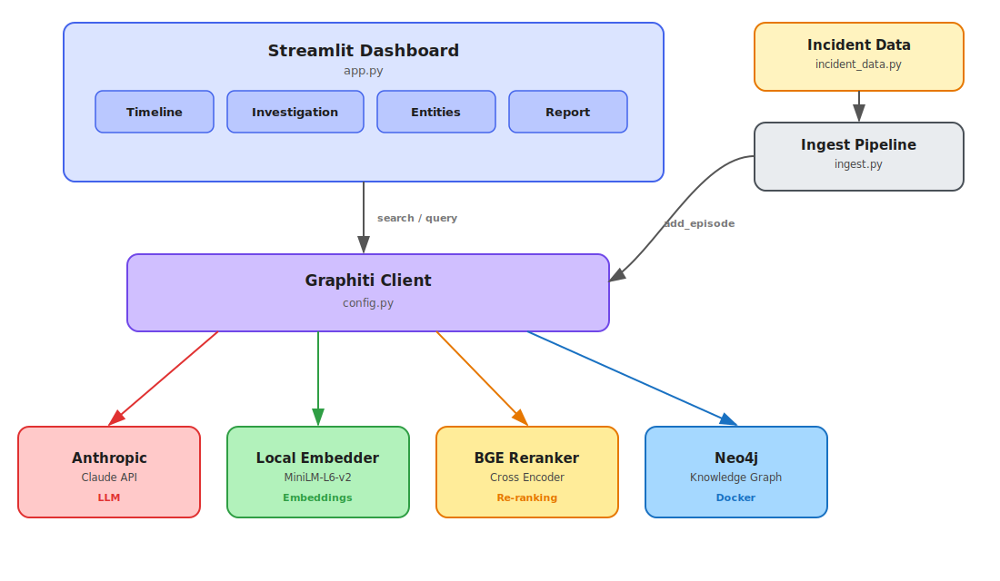

<p align="center">
  
  
  
  
  
  <a href="./LICENSE"></a>
</p>

# Arclight

**Incident investigation powered by temporal knowledge graphs.**

Arclight ingests timestamped incident events (git commits, CI builds, deploys, alerts, Slack messages) into a [Graphiti](https://github.com/getzep/graphiti) temporal knowledge graph backed by Neo4j. A Streamlit dashboard lets you explore the timeline, query the graph in natural language, inspect extracted entities, and generate post-incident reports — all from a single tool.

---

## Table of Contents

- [Features](#features)
- [Architecture](#architecture)
- [Quick Start](#quick-start)
- [Configuration](#configuration)
- [Dashboard](#dashboard)
- [Project Structure](#project-structure)
- [Tech Stack](#tech-stack)
- [Contributing](#contributing)
- [License](#license)

## Features

- **Temporal knowledge graph** — Events are stored with full timestamp fidelity so Graphiti can reason about ordering, causality, and change over time.
- **Natural language investigation** — Ask questions like *"What changed between the deploy and the first alert?"* and get answers grounded in the graph.
- **4-tab dashboard** — Timeline, Investigation, Entities, and Report views give you everything in one place.
- **Local embeddings** — Ships with a local sentence-transformer embedder so graph search works without an external embedding API.
- **Auto-generated reports** — One-click post-incident reports synthesized from graph context via Claude.
- **Graph-enriched entities** — People, services, and systems are automatically extracted and linked by Graphiti.

## Architecture

Data flows through three stages: **Ingest** (timestamped events are fed into Graphiti as episodes), **Store** (Graphiti builds a temporal knowledge graph in Neo4j with entities, relationships, and embeddings), and **Investigate** (the Streamlit dashboard queries the graph for timeline views, natural language answers, and generated reports).

<p align="center">
  
</p>

## Quick Start

> **Prerequisites:** Docker & Docker Compose, Python 3.11+, and an [Anthropic API key](https://console.anthropic.com/).

```bash
# 1. Start Neo4j
docker compose up -d

# 2. Create a virtual environment & install dependencies
python -m venv .venv
source .venv/bin/activate
pip install -r requirements.txt

# 3. Configure environment
cp .env.example .env
# Edit .env and add your ANTHROPIC_API_KEY
```

> **Note:** `VOYAGE_API_KEY` is optional. If omitted, Arclight uses a local sentence-transformer model for embeddings.

```bash
# 4. Ingest incident data into the knowledge graph
python ingest.py

# 5. Launch the dashboard
streamlit run app.py
```

The dashboard opens at **http://localhost:8501**.

## Configuration

All configuration is done via environment variables in `.env` (see `.env.example`).

| Variable | Required | Default | Description |
|---|---|---|---|
| `NEO4J_URI` | Yes | `bolt://localhost:7687` | Neo4j Bolt connection URI |
| `NEO4J_USER` | Yes | `neo4j` | Neo4j username |
| `NEO4J_PASSWORD` | Yes | `graphiti_demo` | Neo4j password |
| `ANTHROPIC_API_KEY` | Yes | — | API key for Claude (used for NL queries and report generation) |
| `VOYAGE_API_KEY` | No | — | Voyage AI API key for embeddings; if omitted, a local sentence-transformer is used |

## Dashboard

The sample incident packaged with Arclight covers a realistic production outage — from the initial git push through CI, deploy, alerts, and Slack triage. The four dashboard tabs let you explore it from different angles:

| Tab | Description |
|---|---|
| **Timeline** | Color-coded event timeline with severity badges |
| **Investigation** | Natural language queries against the knowledge graph |
| **Entities** | People, services, and systems extracted by Graphiti |
| **Report** | Auto-generated post-incident report with graph enrichment |

## Project Structure

```
arclight/
├── app.py                  # Streamlit dashboard (4 tabs)
├── config.py               # Centralized config & Graphiti client factory
├── incident_data.py        # 13 timestamped incident events
├── ingest.py               # Feeds events into Graphiti as episodes
├── local_embedder.py       # Local sentence-transformer embedder
├── docker-compose.yml      # Neo4j 5.26 with APOC plugin
├── requirements.txt        # Python dependencies
├── architecture.svg        # Architecture diagram (rendered)
├── architecture.excalidraw # Architecture diagram (editable source)
├── .env.example            # Environment variable template
└── LICENSE                 # MIT License
```

## Tech Stack

| Component | Technology | Description |
|---|---|---|
| Knowledge graph engine | [Graphiti](https://github.com/getzep/graphiti) | Temporal knowledge graph with episode-based ingestion |
| Graph database | [Neo4j](https://neo4j.com/) 5.26 + APOC | Stores nodes, relationships, and vector indexes |
| LLM | [Claude](https://www.anthropic.com/) (Anthropic) | Powers NL investigation queries and report generation |
| Dashboard | [Streamlit](https://streamlit.io/) | Interactive 4-tab web UI |
| Embeddings | [sentence-transformers](https://www.sbert.net/) | Local embeddings for graph search (Voyage AI optional) |
| Container runtime | [Docker Compose](https://docs.docker.com/compose/) | Runs Neo4j with one command |

## Contributing

Contributions are welcome! To get started:

1. Fork the repository
2. Create a feature branch (`git checkout -b feature/my-change`)
3. Commit your changes (`git commit -m "Add my change"`)
4. Push to the branch (`git push origin feature/my-change`)
5. Open a Pull Request

## License

This project is licensed under the MIT License — see the [LICENSE](./LICENSE) file for details.
